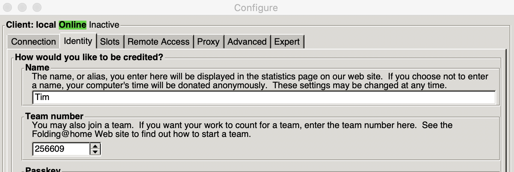
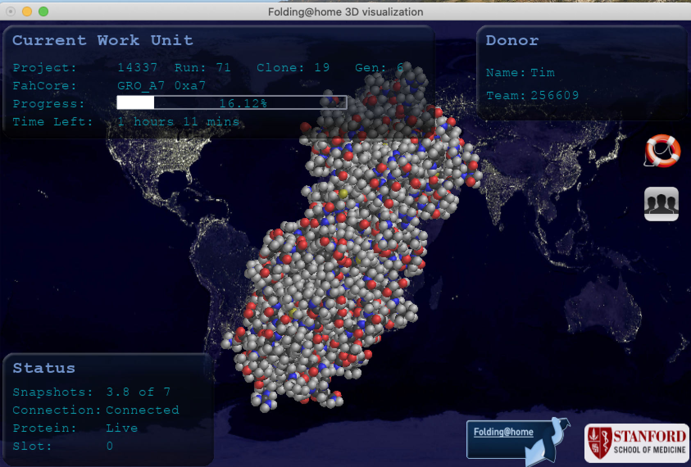

# Brock University Folders

You might of heard of [Folding at Home](https://foldingathome.org/) before. It is a massively distributed computing project to crowd source computation. With this project we are hoping to get the High Performance Computing community at Brock to donate spare computing cycles.

More details in this Folding at Home blog post [Coronavirus – What we’re doing and how you can help in simple terms ](https://foldingathome.org/2020/03/15/coronavirus-what-were-doing-and-how-you-can-help-in-simple-terms/)

##  Partners

- Brock Library - Classroom A computers
- Digital Scholarship Lab Staff Home Computers

## How Can I help?

You can install the folding software on your home computer ([Windows](https://foldingathome.org/support/faq/installation-guides/windows/)) ([Mac](https://foldingathome.org/support/faq/installation-guides/mac/)) ([Linux](https://foldingathome.org/support/faq/installation-guides/linux/)) Follow all the instructions as outlined on the page

Join our team [The Brock University Folders](https://stats.foldingathome.org/team/256609) In the config section of the client, enter in your name and use **256609** for team number.

Let us know you're helping by sending an email to dsl@brocku.ca 

Start Folding!

## How Can My Lab Help?

The good new is that the client is built for Linux, Mac, Windows you name it. The software can run as a screensaver on your computer so it will only start when you're not using it. 

Once you do or if you need help please contact us at dsl@brocku.ca so we can add you to our list.

## How are we doing so far?

Good question, check out the team page for more info: [https://stats.foldingathome.org/team/256609](https://stats.foldingathome.org/team/256609)

## Need Help?

Contact us via email at dsl@brocku.ca

Find us on [Twitter](https://twitter.com/brock_dsl)